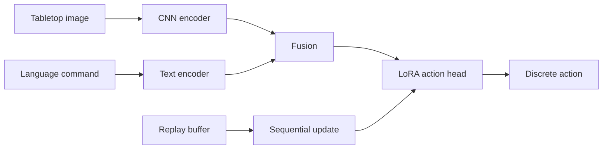

# Continual VLA Learning for Humanoid Robot Manipulation

**Status: active development — first continual-learning foundation implemented.**

A reproducible research project for studying lifelong skill acquisition in
vision-language-action (VLA) robot policies. The current reference backend receives a synthetic
tabletop image and a natural-language command, then predicts one of five discrete
actions: `left`, `right`, `up`, `down`, or `grasp`.

The project compares sequential parameter-efficient fine-tuning with and without
Experience Replay. It is intentionally small enough to run on a laptop CPU.

The end-to-end target is parameter-efficient adaptation of a pretrained VLA in a
manipulation simulator, followed by a humanoid-simulation extension. The compact
backend implemented first provides a fast, deterministic test bed for PEFT,
Experience Replay, sequential evaluation, and forgetting metrics before the
compute-heavy integration.

> **Truthful scope:** The current milestone is not a humanoid deployment and not
> a safety-certified robot controller. It does not claim that pretrained-VLA or
> humanoid-simulation integration is already complete.

## Implementation status

| Capability | Status |
|---|---|
| Vision + language conditioned action policy | Implemented (compact reference backend) |
| LoRA-style parameter-efficient adaptation | Implemented |
| Sequential task curriculum and Experience Replay | Implemented |
| Accuracy and catastrophic-forgetting metrics | Implemented |
| Pretrained VLA integration | Next milestone |
| Manipulation simulator and continuous actions | Next milestone |
| Humanoid simulation and ROS 2 interface | Planned extension |

## Why this project

Continual robot learning must add new skills without catastrophically forgetting
old ones. This repository demonstrates the mechanics needed to investigate that
problem:

- visual observations and language-conditioned action prediction;
- a frozen multimodal backbone with trainable LoRA adapters;
- sequential learning across task groups;
- bounded Experience Replay;
- accuracy matrices and task-forgetting measurements;
- deterministic data generation and experiment configuration.

## Architecture



## Continual-learning protocol

The synthetic curriculum contains three stages:

1. horizontal motion: `left`, `right`;
2. vertical motion: `up`, `down`;
3. manipulation: `grasp`.

After every stage, the policy is evaluated on every task seen so far. Two runs
are compared:

- **sequential PEFT:** current-stage samples only;
- **PEFT + replay:** current-stage samples mixed with a bounded memory of older
  samples.

For task \(j\), forgetting is reported as the best previous accuracy minus the
final accuracy on that task.

## Quick start

```bash
python -m venv .venv
source .venv/bin/activate
pip install -r requirements.txt
python -m lifelong_vla.train --config configs/quick.yaml
```

Run the tests:

```bash
python -m unittest discover -s tests -v
```

The training command writes JSON metrics and a comparison plot into `results/`.

## Repository structure

```text
configs/                 Experiment settings
lifelong_vla/
  data.py                Deterministic synthetic scenes and commands
  model.py               Multimodal policy and LoRA linear layer
  replay.py              Reservoir-sampling replay memory
  metrics.py             Accuracy matrix and forgetting calculation
  train.py               Sequential-training experiment
tests/                   Unit and smoke tests
results/                 Generated experiment outputs (not committed)
```

## Expected experiment output

The script creates a stage-by-task accuracy matrix for each method and reports:

- final average accuracy;
- average forgetting;
- trainable and total parameter counts;
- replay-buffer occupancy.

No benchmark values are stated in this README before the experiment has been run
in a fully provisioned PyTorch environment.

## Next steps toward a stronger robotics study

- replace synthetic scenes with demonstrations from LeRobot or RLBench;
- initialize the encoders from a genuinely pretrained vision-language policy;
- predict continuous end-effector actions;
- connect the policy to MuJoCo, Isaac Lab, or ROS 2;
- add verbal commands through automatic speech recognition;
- evaluate on a physical manipulator or humanoid platform.

## License

MIT
